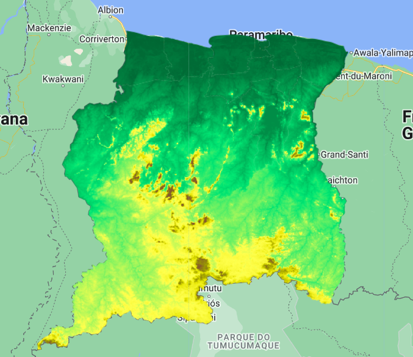
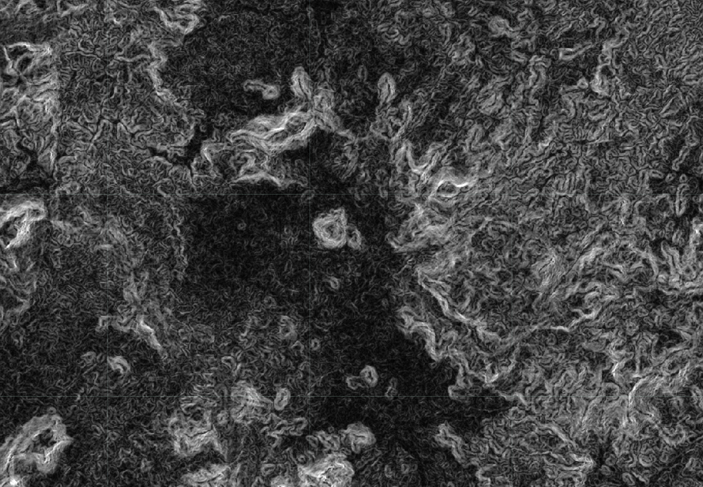

# Elevation data

In this session, we will work with another type of raster data rather than satellite imagery. We will work with elevation data.

The Shuttle Radar Topography Mission (SRTM) payload flew aboard the Space Shuttle Endeavour during the STS-99 mission. SRTM collected topographic data over nearly 80% of Earth's land surfaces, creating the first-ever near-global dataset of land elevations (digital elevation model) at a resolution of 1 arc-second (approximately 30m). Nowadays, there are many other DEM products available for free and paid use. In this session we will work with the SRTM elevation product, a void-filled version of this same elevation product, and the MERID DEM product - a high accuracy global DEM at 3 arc second resolution (~90 m at the equator) produced by eliminating major error components from existing DEMs (NASA SRTM3 DEM, JAXA AW3D DEM, Viewfinder Panoramas DEM).

First, we define de area of interest (Suriname) and center the map to this object.

```javascript
//--------------------------------------------------------------
// Define area of interest (vector data)
//--------------------------------------------------------------

var suriname = ee.FeatureCollection('projects/caribbean-trainings/assets/suriname-2023/boundary');

Map.centerObject(suriname, 7);
```

Now, we define the SRTM dataset as a variable, select the `elevation` band and clip this image to the boundaries of suriname using the `clip` function and the vector `suriname` variable as the polygon to clip the image to.

```javascript
//--------------------------------------------------------------
// NASA SRTM original (30 m)
//--------------------------------------------------------------

// Elevation
var srtm = ee.Image('USGS/SRTMGL1_003');
var elevation = srtm.select('elevation').clip(suriname);
```

Now, we can add the clipped image to the map. We will use a `palette` of colors where lowland areas have the color green, high altitude areas have color brown and in between elevation values range from light green to dark yellow. We do this by using a HEX code for each color. A hex color code is a 6-symbol code made of up to three 2-symbol elements. Each of the 2-symbol elements expresses a color value from 0 to 255. The code is written using a formula that turns each value into a unique 2-digit alphanumeric code (example of color picker website: [https://htmlcolorcodes.com/](https://htmlcolorcodes.com/)).

```javascript
Map.addLayer(elevation, {
  min: 0, 
  max: 700, 
  palette:['006633','00e673','ffff4d','e6e600','999900','86592d']
  
}, 'Elevation SRTM');
```

Observe the image added to the map. Do areas with low and high elevations make sense to you? Trying changing the `min` and `max` values to see how the stretching of colors change.



Earth Engine has a very useful "library" of functions for terrain applications which work with the `ee.Terrain` object. Next, we will calculate the slope for each pixel using the elevation image and the constructor `ee.Terrain.slope` and add it to the map.

```javascript
// Slope
var slope = ee.Terrain.slope(elevation);
Map.addLayer(slope, {min: 0, max: 50}, 'slope');
```

The resulting image look like contour lines if you zoom in.



Now, we can define and add to the map the other elevation data (void-filled SRTM DEM and MERIT DEM):

```javascript
//--------------------------------------------------------------
// NASA SRTM processed to fill voids (30 m)
//--------------------------------------------------------------

// Import the dataset and select the elevation band.
var srtmP = ee.Image('NASA/NASADEM_HGT/001');
var elevationP = srtmP.select('elevation').clip(suriname);

// Add to the map.
Map.addLayer(elevationP, {
  min: 0, 
  max: 700, 
  palette:['006633','00e673','ffff4d','e6e600','999900','86592d']
  
}, 'Elevation SRTM P');


//--------------------------------------------------------------
// MERIT DEM (90 m)
//--------------------------------------------------------------

var merit = ee.Image('MERIT/DEM/v1_0_3');
var elevationM = merit.select('dem').clip(suriname);

Map.addLayer(elevationM, {
  min: 0, 
  max: 700, 
  palette:['006633','00e673','ffff4d','e6e600','999900','86592d']
  
}, 'Elevation MERIT');
```

Explore the three different elevation layers, do they present differences?

## Complete code

Script "`2 Elevation data`" from the repository and folder `T3` or direct link:
[https://code.earthengine.google.com/9ce5f8e96162f186588b47dda696acd3](https://code.earthengine.google.com/9ce5f8e96162f186588b47dda696acd3).
