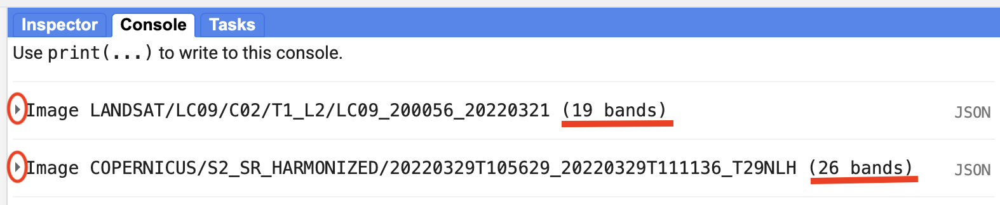
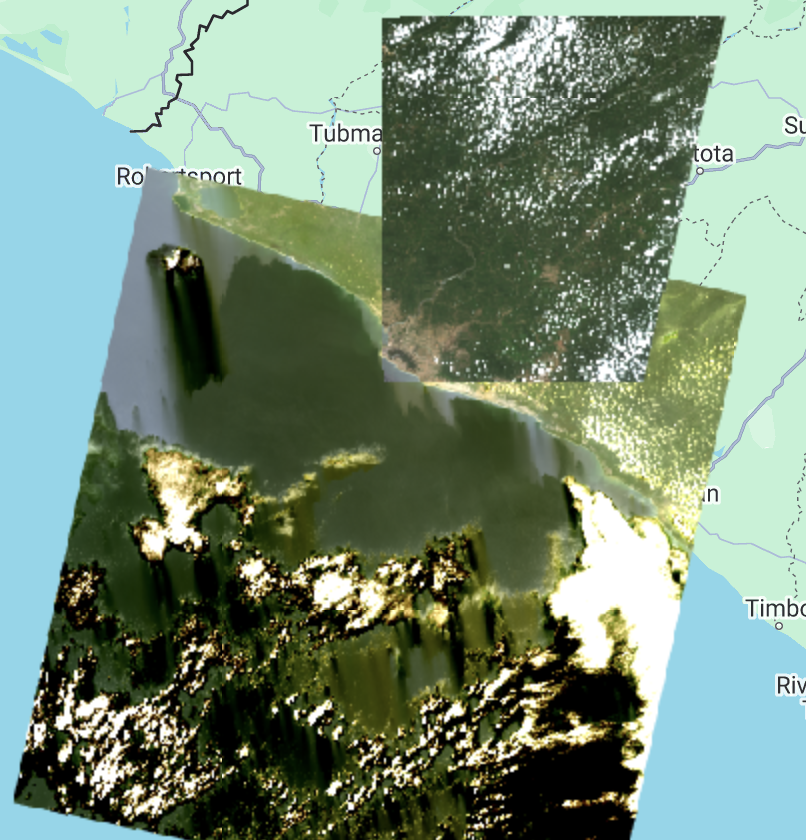
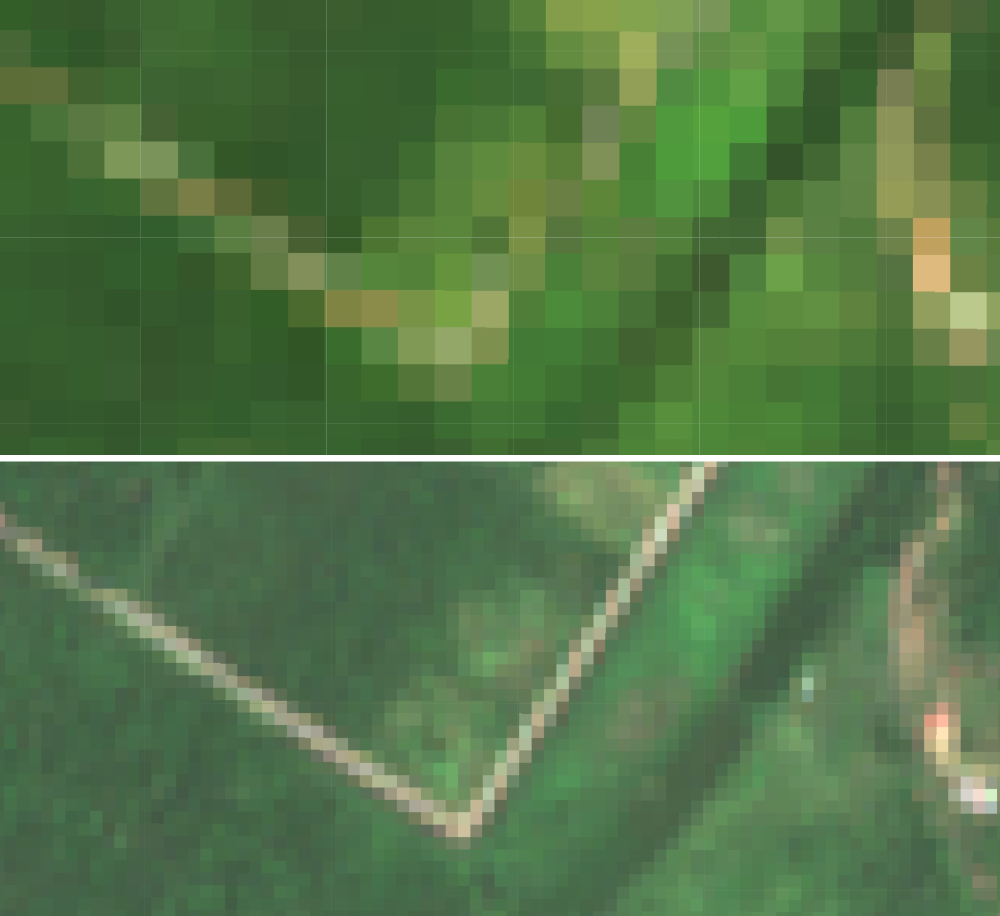
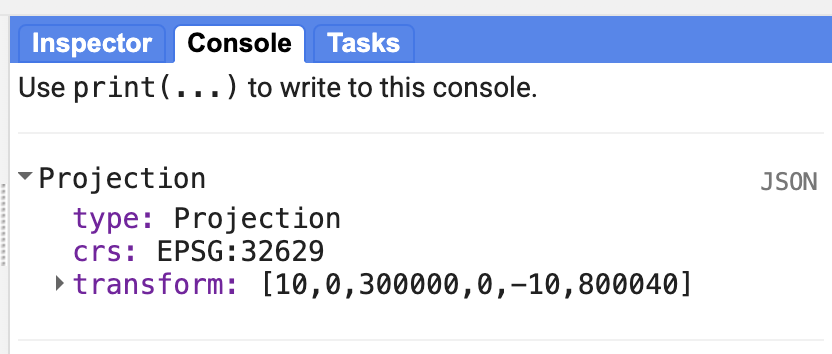

# Image Visualization - Landsat 9 and Sentinel-2

## Adding another satellite image to the map

We have seen how to visualize an image and the different band combinations that we can elect when visualizing an image. With the following code snippets, we will add to the map the same Landsat 9 image we worked with previously and a new Sentinel-2 image for comparison.

Start by defining the variable for the Landsat 9 image, printing it to the Console, and setting a center for the map. Note that the we will use a new center map function: `Map.setCenter`. This function centers the map based on a center point and it requires 3 arguments: `longitude`, `latitude`, and `zoom level`. Then, we add the image to the map using the True Color band combination.

```javascript
var firstImageL9 = ee.Image('LANDSAT/LC09/C02/T1_L2/LC09_229056_20220924');
print(firstImageL9);

Map.setCenter(-55.3807, 5.7495, 9);

Map.addLayer(
    firstImageL9,
    {
        bands: ['SR_B4', 'SR_B3', 'SR_B2'],
        min: 7000,
        max: 12000
    },
    'True Color L9');
```

Next, we will define a variable `firstImageS2` which will store an `ee.Image` object of a Sentinel-2 scene from September 26, 2022 -  an image taken 2 days after the Landsat 9 image. We print and add this image to the map also using the True Color band combination. In this case, the red, green, and blue band designations for Sentinel-2 are the same as for Landsat 9 (Red is band 4, Green is band 3, and Blue is band 20). This won't always be the case. The Sentinel-2 band names do not have the prefix `SR_` appended to it.

```javascript
var firstImageS2 = ee.Image('COPERNICUS/S2_SR/20220926T140709_20220926T141005_T21NXG');
print(firstImageS2);

Map.addLayer(
    firstImageS2,
    {
        bands: ['B4', 'B3', 'B2'],
        min: 600,
        max: 3000
    },
    'True Color S2');
```

In the Console, can you see the difference in band quantity? Open the Earth Engine catalog for both datasets ([USGS Landsat 9 Level 2, Collection 2, Tier 1](https://developers.google.com/earth-engine/datasets/catalog/LANDSAT_LC09_C02_T1_L2)  & [Sentinel-2 MSI: MultiSpectral Instrument, Level-2A](https://developers.google.com/earth-engine/datasets/catalog/COPERNICUS_S2_SR)) and see the different band designations. Inspect the metadata for both images in the Console as well.



On the map, note the difference in image colors. This can be due to differences in spectral resolutions, processing steps, and other factors. Why does the Sentinel-2 image cover a smaller area compared to the Landsat 9 image? Zoom in until you can see both images' pixel sizes. Do you note the difference in spatial resolution? Remember, Landsat 9 images have a 30 m spatial resolution whereas Sentinel-2 images have a 10 m spatial resolution. Landsat 9 covers a larger area but at the cost of the spatial resolution. Sentinel-2 has a higher spatial resolution but at the cost of covering a smaller area.





## Projection and Scale

You can also print the projection and scale of the image. Different bands might have different spatial resolutions, because of that, we need to select a specific band to display the projection information. Below, we select band 2 of the Sentinel-2 image using the `select()` function. This function returns an image with just one band (in this case, band 2). Then we apply a `projection()` function. This function returns a `ee.Projection` object. We can print this variable in the Console to see which projection the image is in.

```javascript
var projection = firstImageS2.select('B2').projection();
print(projection);
```

On the Console we see that the Sentinel-2 image is in the EPSG:32621 projection.



We can also print the scale of the image (spatial resolution). A `ee.Projection` object has a function called `nominalScale()` that returns the linear scale in meters of the units of this projection, as measured at the point of true scale. The type of object that it is returned is a Float number.

```javascript
var scale = projection.nominalScale();
print(scale);
```

With this, we see on the Console that the scale is what we expected, 10 meters.

## Exporting an image

The GEE API provides export functions that allow us to export an image in different ways: to Google Drive, as and EE Asset (not leaving the Earth Engine environment), and to Google Cloud. If we want to work with the image outside of GEE, we can use the `Export.image.toDrive` function.

```javascript
Export.image.toDrive({
  image: firstImageS2.int16(),
  scale: 10,
  region: area,
  description: 'sentinel2image',
  fileNamePrefix: 'S2 Paramaribo 220926',
  maxPixels: 1e13
})
```

Check this function's description in the `Docs` tab for more information.

You will see that once you run the code, the `Tasks` tab will flash orange and you will see the option to `Run` this export task. It might take several minutes for your image to export. Once the export task is finalized, you will be able to download the tif file(s) from your Google Drive ([https://drive.google.com/drive/my-drive](https://drive.google.com/drive/my-drive)).

## Complete code

Script "`1 Image Visualization - L9 & S2`" from the repository and folder `T3` or direct link: [https://code.earthengine.google.com/690d887ea9224bec426df51f278e9ab4](https://code.earthengine.google.com/690d887ea9224bec426df51f278e9ab4).
