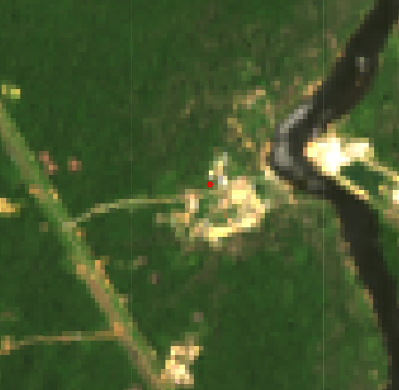

# Importing Mercury data into GEE

You can use the Asset Manager (`Assets` tab on the left side of the Code Editor) to upload raster and vector datasets. For raster data, you can upload an image or other georeferenced raster datasets in GeoTIFF or TFRecord format. For vector data, you can upload datasets in the Shapefile or CSV format. Your uploaded assets are initially private, but can be shared as described in the [Sharing Assets Section tutorial of GEE](https://developers.google.com/earth-engine/guides/asset_manager#sharing-assets).

In this session, we will upload Mercury data from the [GONINI portal](https://gonini.org/).

1. First, go to [https://gonini.org/](https://gonini.org/)
2. Expand "Landuse Landcover Maps" and then "Mining"
3. Click on the download icon to download the "Suriname Mercury Observatory" data.


4. Add your email and click on "Mercury Observatory" to download the .zip (or .rar) file to your local machine. If .rar, convert to .zip.
5. In the Code Editor, go to the `Assets` tab and click on `NEW`. Then select Shapefiles under the Table Upload section. An upload dialog similar to the figure below will be presented.


6. Click the `SELECT` button and navigate to the Zip archive you downloaded on your local file system. Make sure filenames do not include additional periods or dots. (Filenames will include a single period before the extension.)
7. After starting a table upload, an 'Asset ingestion' task is added to the Task Manager, found under the `Tasks` tab at the right side of the Code Editor. Check the upload status by clicking on the ? icon that appears when hovering over the task. To cancel an upload, click on the spinning icon  next to the task. Once the ingestion is complete, the task cell will turn blue and the asset will appear in your user folder under the Assets tab with a table_chart icon.
8. Finally, copy and paste the code below to add the mercury data over the images we were working with previously.

```javascript
var firstImageL9 = ee.Image('LANDSAT/LC09/C02/T1_L2/LC09_229056_20220924');
print(firstImageL9);

Map.setCenter(-55.3807, 5.7495, 9);

Map.addLayer(
    firstImageL9,
    {
        bands: ['SR_B4', 'SR_B3', 'SR_B2'],
        min: 7000,
        max: 12000
    },
    'True Color L9');

var firstImageS2 = ee.Image('COPERNICUS/S2_SR/20220926T140709_20220926T141005_T21NXG');
print(firstImageS2);

Map.addLayer(
    firstImageS2,
    {
        bands: ['B4', 'B3', 'B2'],
        min: 600,
        max: 3000
    },
    'True Color S2');

var projection = firstImageS2.select('B2').projection();
print(projection);

var scale = projection.nominalScale();
print(scale);

// Export.image.toDrive({
//   image: firstImageS2.int16(),
//   scale: 10,
//   region: area,
//   description: 'sentinel2image',
//   fileNamePrefix: 'S2 Paramaribo 220926',
//   maxPixels: 1e13
// })

var mercury = ee.FeatureCollection('projects/caribbean-trainings/assets/suriname-2023/mercuryData');
Map.addLayer(mercury,{color: 'red'}, 'Mercury data');
```

The mercury data will be the red points in your map. Use the `Inspector` to assess the mercury information at each point.




For more information about uploading assets, check:
- [https://developers.google.com/earth-engine/guides/asset_manager](https://developers.google.com/earth-engine/guides/asset_manager)
- [https://developers.google.com/earth-engine/guides/table_upload](https://developers.google.com/earth-engine/guides/table_upload)
- [https://developers.google.com/earth-engine/guides/image_upload](https://developers.google.com/earth-engine/guides/image_upload)

## Complete code

Script "`3 Mercury data`" from the repository and folder `T3` or direct link:
[https://code.earthengine.google.com/9ce5f8e96162f186588b47dda696acd3](https://code.earthengine.google.com/9ce5f8e96162f186588b47dda696acd3).
