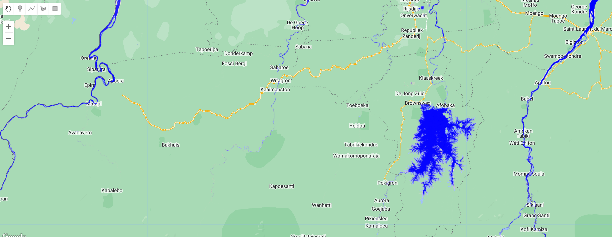

# Surface water data

The [JRC Global Surface Water Mapping Layers, v1.4](https://developers.google.com/earth-engine/datasets/catalog/JRC_GSW1_4_GlobalSurfaceWater), dataset contains maps of the location and temporal distribution of surface water from 1984 to 2021 and provides statistics on the extent and change of those water surfaces. For more information see the associated journal article: High-resolution mapping of global surface water and its long-term changes (Nature, 2016) and the online Data Users Guide.

These data were generated using 4,716,475 scenes from Landsat 5, 7, and 8 acquired between 16 March 1984 and 31 December 2021. Each pixel was individually classified into water / non-water using an expert system and the results were collated into a monthly history for the entire time period and two epochs (1984-1999, 2000-2021) for change detection.

This mapping layers product consists of 1 image containing 7 bands. It maps different facets of the spatial and temporal distribution of surface water over the last 38 years. Areas where water has never been detected are masked.

Copy and paste the code below to add the water occurrence for Suriname:

```javascript
//--------------------------------------------------------------
// Define area of interest (vector data)
//--------------------------------------------------------------

var suriname = ee.FeatureCollection('projects/caribbean-trainings/assets/suriname-2023/boundary');

Map.centerObject(suriname, 7);

//--------------------------------------------------------------
// JRC Water
//--------------------------------------------------------------

var dataset = ee.Image('JRC/GSW1_4/GlobalSurfaceWater').clip(suriname);

var visualization = {
  bands: ['occurrence'],
  min: 0.0,
  max: 100.0,
  palette: ['ffffff', 'ffbbbb', '0000ff']
};

Map.addLayer(dataset, visualization, 'Occurrence');
```



## Complete code

Script "`4 Surface water data`" from the repository and folder `T3` or direct link:
[https://code.earthengine.google.com/c86337f2c16011da8a52abd6141f1a4b](https://code.earthengine.google.com/c86337f2c16011da8a52abd6141f1a4b).
