# Satellite images in GEE - Browsing & pre-processing

This exercise will walk us through retrieving and visualizing Landsat 8 data collections. Create a new repository called ‘training-servir-gee’.

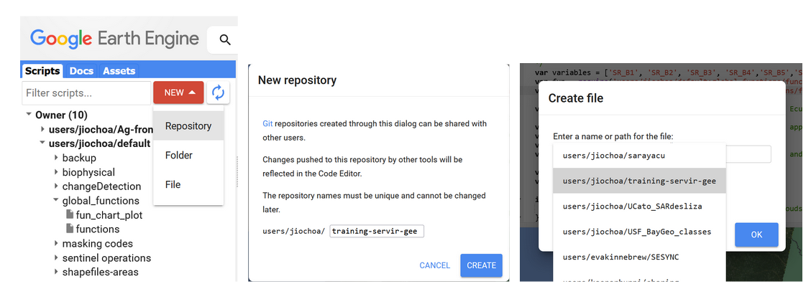

Figure 3. Creating a new script.

We set the name for our new script ‘sat_image_processing’.

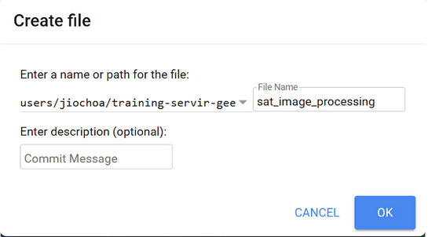

Figure 4. Naming a new script

We look for Landsat 8 surface reflectance (SR) Collection 2 Tier 1 data. Collection 1 is already deprecated and Tier 1 comprises the highest radiometric and terrain correction quality.

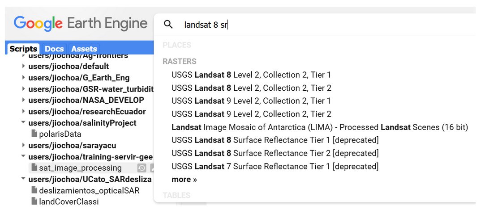

Figure 5. Catalog search bar showing Landsat datasets.

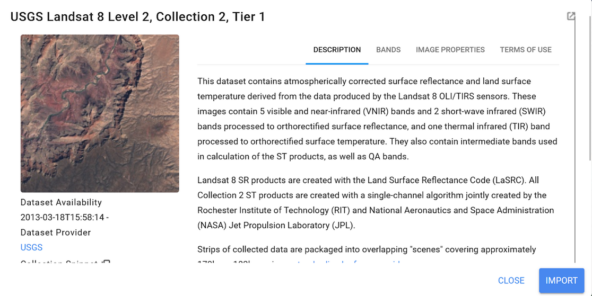

Figure 6. Landsat 8 description.

Lets hit the ‘Import’ button, and change the name of the collection to ‘*landsat8_sr*’. Now let's download the boundary shapefile of Guyana. We are going to upload this file into the Assets section to have our country boundary available. First you can add a new project pressing the *ADD A PROJECT* button within the Assets section:

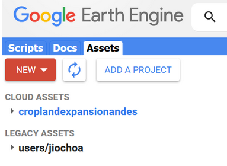

Figure 7. Adding a new project

You can provide a name or id for the new cloud project,and then press ‘Select’.

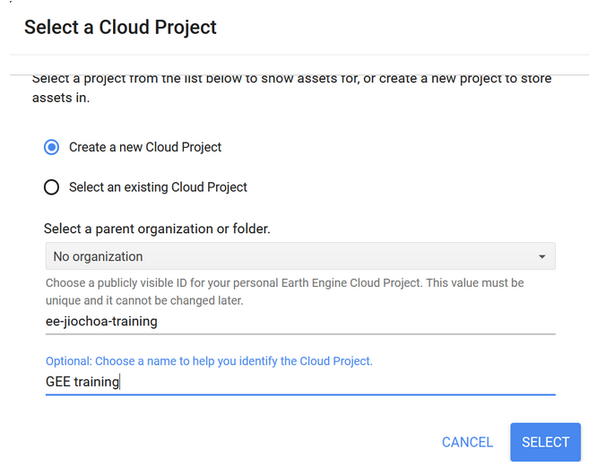

Figure 8. Cloud project set-up window.

Now press the *New* button and select the *Shape files* options within the *Table Upload* section.

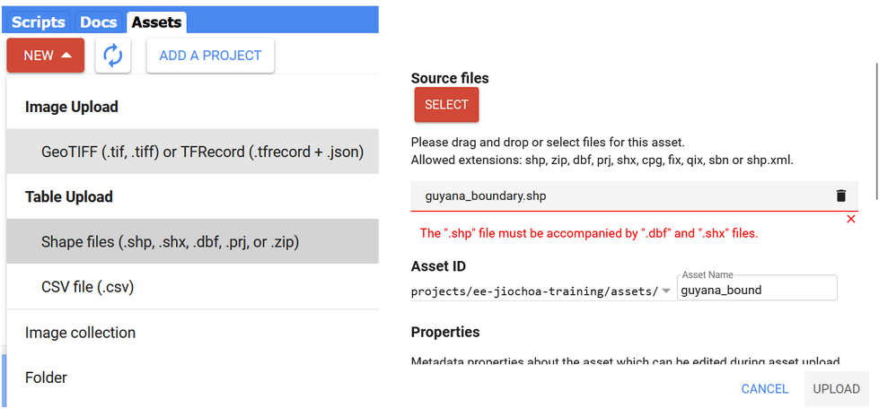

Figure 9. Uploading a new shapefile into the Assets.

When selecting the shapefile, make sure to select all of its components, but ignore the *qpj* file. For example, avoid errors like “The file named "guyana_boundary.qpj" does not have a correct extension” or “the shapefile must be accompanied by ‘dbf”


Figure 10. Shapefile properties.

The two-arrows icon permits us to refresh the view in case you don’t see the uploaded file. We click on the file name to open it:

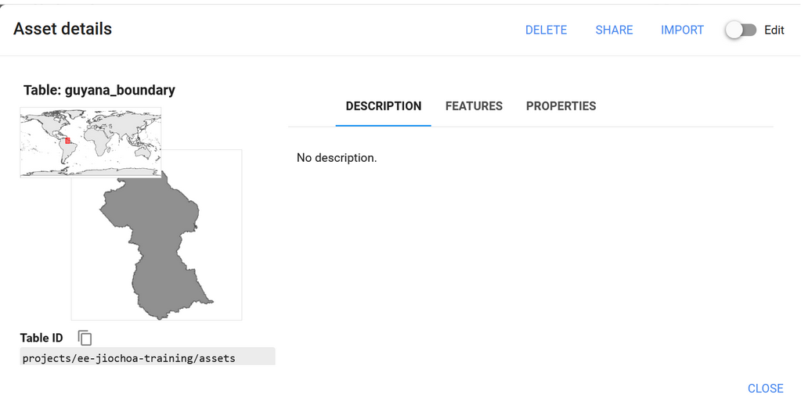

Figure 11. Shapefile loaded.

Click on ‘*Import*’ and change the name to *guyana_bou*. Now let’s work filtering our current image collection over three aspects: temporal, spatial, and spectral.

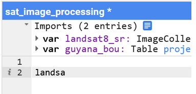

Figure 12. Typing an existent variable name

When typing you can press *Ctrl* + *spacebar* to autocomplete names of existent variables, or *Ctrl* + *spacebar* after inserting a point to observe a list of available functions

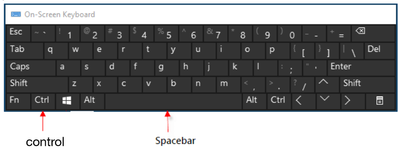

Figure 13. Keyboard shortcut

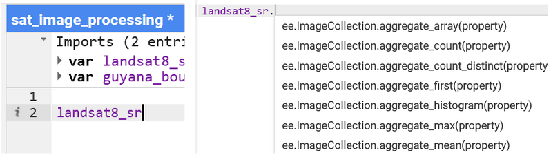

Figure 14. Available functions listed.

The following code selects 3 months of Landsat 8 imagery over Guyana territory. Immediately we apply a scale factor.

```javascript
landsat8_sr = landsat8_sr
            	.filterDate('2022-10-01', '2022-12-31')
            	.filterBounds(guyana_bou)

// Applies scaling factors needed for Landsat collection 02
function applyScaleFactors(image) {
  var opticalBands = image.select('SR_B.').multiply(0.0000275).add(-0.2);
  var thermalBands = image.select('ST_B.*').multiply(0.00341802).add(149.0);
  return image.addBands(opticalBands, null, true)
          	.addBands(thermalBands, null, true);
}


landsat8_sr = landsat8_sr.map(applyScaleFactors);
We can also select only the required bands, e.g. excluding the first band of coastal aerosol.  The visualization setting must be described.

var visualization = {
  bands: ['SR_B4', 'SR_B3', 'SR_B2'],
  min: 0.0,
  max: 0.3,
};

Map.centerObject(guyana_bou, 6)

Now we visualize the layers created using the 
Map.addLayer(guyana_bou, {}, 'guyana', 0)
Map.addLayer(landsat8_sr, visualization, 'True Color (432)');
```

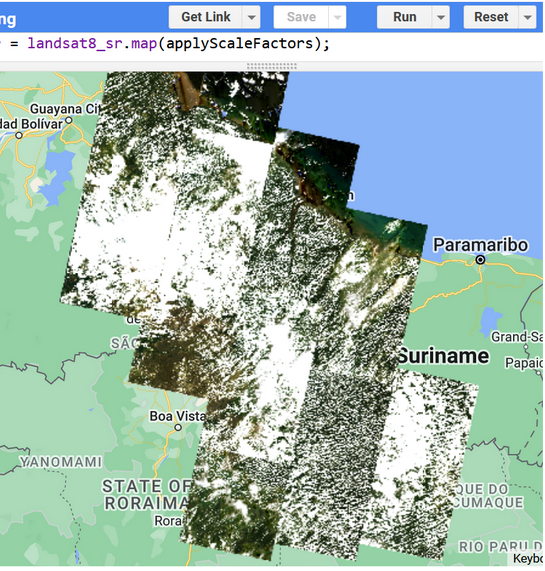

Figure 15. True color Landsat 8 collection 2 mosaic for Guyana.

We have added the layer of surface reflectance (SR) values for 3 months to visualize. You can check the code link at [https://code.earthengine.google.com/c242421f3cc5229e8e24bd019b8f6ceb](https://code.earthengine.google.com/c242421f3cc5229e8e24bd019b8f6ceb).
