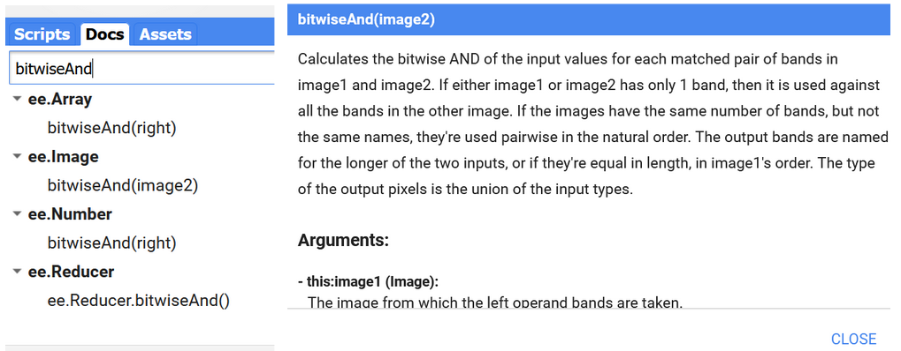
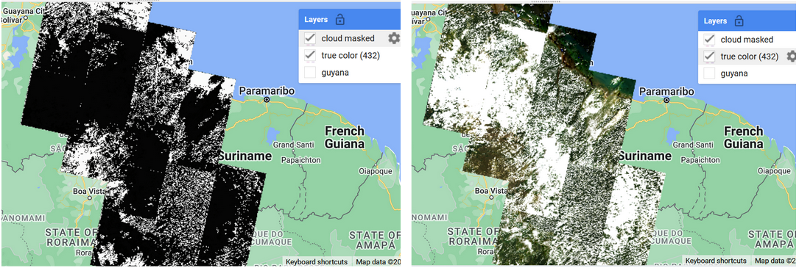
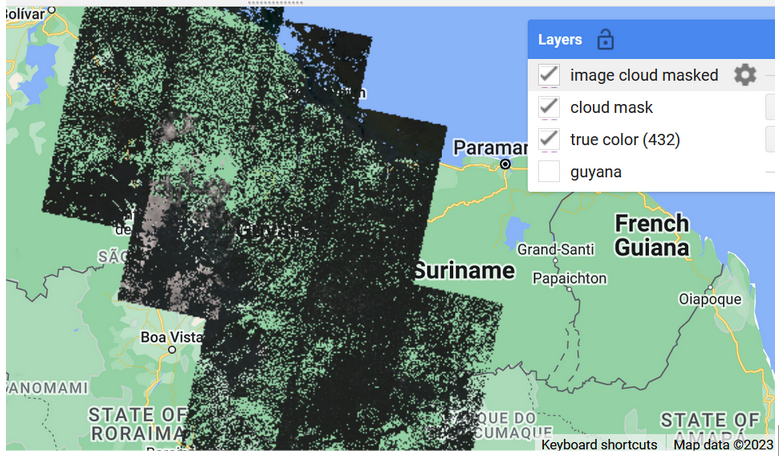
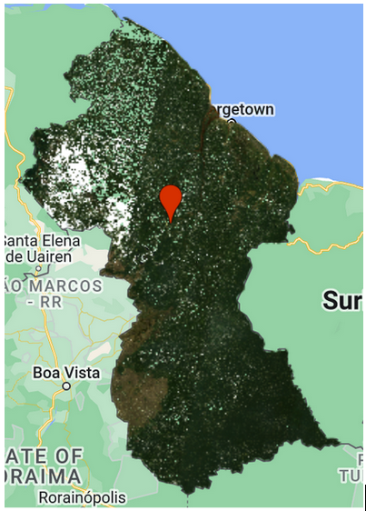
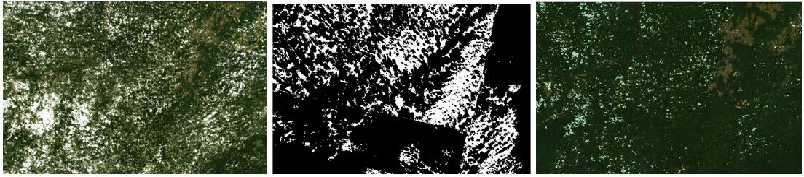

# Processing and cloud masking of composites over Landsat data

This exercise will demonstrate how to create a cloud-cloud shadow mask using Earth Engine over Landsat imagery. We use the quality assessment (QA) pixel band to create a cloud and shadow mask. Bits 3 and 4 are cloud and cloud shadow, respectively. We define a function which always includes the ***return*** command to provide the resultant product.

```javascript
function cloudShadowMask(image) {
  var cloudsBitMask = (1 << 3);//
  var cloudShadowBitMask = (1 << 4);
  // Get the pixel QA band.
  var qa = image.select('QA_PIXEL');
  var mask = qa.bitwiseAnd(cloudShadowBitMask).eq(0)
            	.and(qa.bitwiseAnd(cloudsBitMask).eq(0))
            	.copyProperties(image,['system:time_start','system:time_end','system:index']);
  return ee.Image(mask)        	 
}
```

The QA_PIXEL band is the information channel that characterizes the quality of the pixel regarding cloud and cloud shadow. How to use this info?...  If we want to know about a specific function we can go to the ‘Docs’ section and type the function name, then click on the function and see the specification, parameters and application of it. Look closely at the type of object you’re applying to. In this case, we are looking for the bitwiseAnd operator for the object *image* (ee.Image).



Figure 16. BitwiseAnd function description.

```javascript
var cloudMask= landsat8_sr.map(cloudShadowMask)
print('cloud_mask: ', cloudMask)


Map.addLayer(cloudMask, {}, 'cloud mask')

var cloudMasking = function (image) {
  var cloudsBitMask = (1 << 3);   // Bits 3 and 4 are cloud and cloud shadow, respectively.
  var cloudShadowBitMask = (1 << 4);
  var qa = image.select('QA_PIXEL');	// Get the pixel QA band.
  var mask = qa.bitwiseAnd(cloudShadowBitMask).eq(0)
            	.and(qa.bitwiseAnd(cloudsBitMask).eq(0))
            	.copyProperties(image,['system:time_start','system:time_end','system:index']);
  return image.updateMask(mask)        	 
}
```

Through the command map we apply the function to the Landsat dataset. We define the visualization parameters: the basic values to be specified are the bands to occupy the blue, green and red channels, plus min and max reflectance value, which will depend on the range of values. Here you have to take in account that Landsat collection 2 values are factored per 10000 by default, with a common max value of 3000.  Values higher than 3000 usually fall in the category of cloudy areas, saturated values or outliers derived from radiometric errors of the sensor.

```javascript
var landsat8_sr_masked = landsat8_sr.map(cloudMasking)
// visualization Landsat 8 collection 2
var visual_lan = {
  bands: ['SR_B4', 'SR_B3', 'SR_B2'],
  min: 0.0,
  max: 0.3,
};
Map.addLayer(landsat8_sr, visual_lan, 'true color landsat');
Map.addLayer(landsat8_sr_masked, visual_lan , 'Cloud masked Landsat composite')
```


 
Figure 17. Cloud mask product (left) versus Landsat-8 mosaic (right).

As we see, the black pixels correspond to cloud cover, and the white areas correspond to cloud-free areas. We can always check the mask structure compared to the true color mosaic and see how well it identified the cloud cover.

Now that the cloud mask has been generated, we apply it to the image collection.



Figure 18. Cloud masked Landsat mosaic.  All the clouds have been removed.

However we need to compute a value representing the series of SR values.  Usually a statistic as the median works well. Additionally we can clip the image to frame it to the Guayana border

```javascript
var l8_sr_med = l8_sr_cloud_masked.median()
    	.select('SR_B2','SR_B3','SR_B4','SR_B5', 'SR_B6', 'SR_B7')
  	. clip(guyana_bou)
Map.addLayer(l8_sr_med, visual_lan, 'true color landsat median');
```



Figure 19. Computed temporal median of a Landsat-8 collection, plus clipped.

We can analyze and compare some very cloudy areas after they have been cloud-masked. For this checkpoint you can go the link at [https://code.earthengine.google.com/7b26479cbd8ca711b1e0023e5afaff99](https://code.earthengine.google.com/7b26479cbd8ca711b1e0023e5afaff99).



Figure 20. Comparison of products: (left) not masked mosaic, (center) cloud mask, (right) cloud-masked mosaic

Since we see many gaps in the masked image, we can select a longer period in order to have a greater pool of images and higher chance of getting less clouded images.
